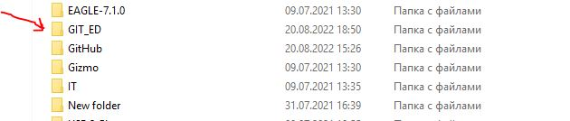
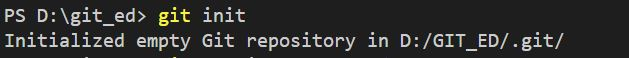
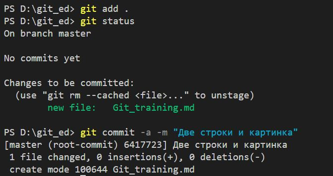
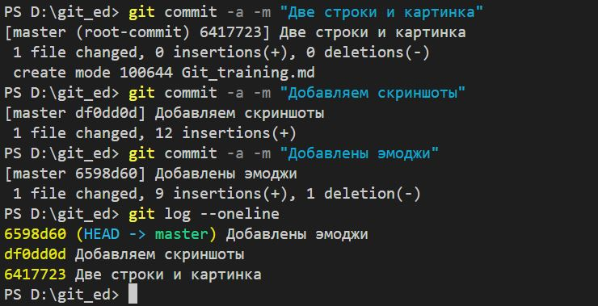
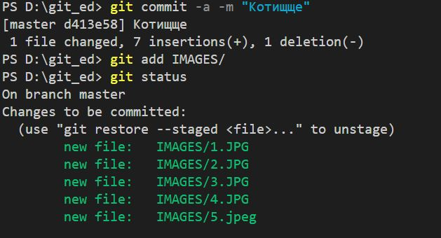
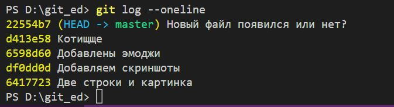
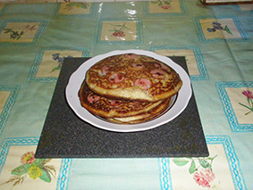
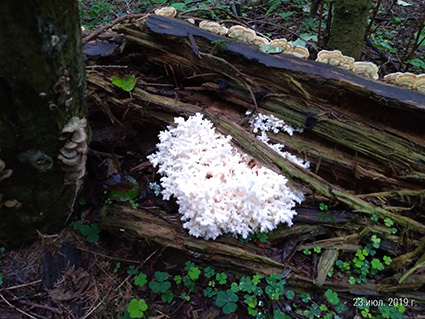

# ***РАБОТА С GIT***

>*Создаем директорию*

>Инициализируем директорию

>Добавляем файл в отслеживаемые и фиксируем изменения.

## ПОПРОБУЕМ ЭМОДЖИ

👾🐺🌵🐲🐿🌈

> *ЭМОДЖИ ВСТАВИЛИСЬ*

### ЗАФИКСИРУЕМСЯ, ПРОСМОТРИМ ЖУРНАЛ

### ФИКСИРЕУМ, ДОБАВЛЯЕМ ДИРЕКТОРИЮ "IMAGE" В ОТСЛЕЖИВАЕМЫЕ

### ЕЩЕ РАЗ ПРОСМАТРИВАЕМ ЖУРНАЛ

### ВСТАВИМ ССЫЛКУ

## **Link**

[YANDEX](https://yandex.ru)

### ЕЩЕ ОДНА ССЫЛКА

[MY GITHUB](https://github.com/AMBER2136/TRAIN_1)

### ДОБАВИМ КАРТИНКУ

# *Image*

<image src= "IMAGES/Cat.jpg">

> И ЕЩЕ ОДНА КАРТИНКА

> И ЕЩЕ ОДНА

>И ЕЩЕ ОДНА

## ***Table***

|Product description   |Product Price |
|:---------------------|:-----------------:|
|       Nail     |         12           |
|         Screw       |       14            |
| Profiled nut            |                11  |

#    ***IT IS `CONCLUSION`: I LIKE MD***

